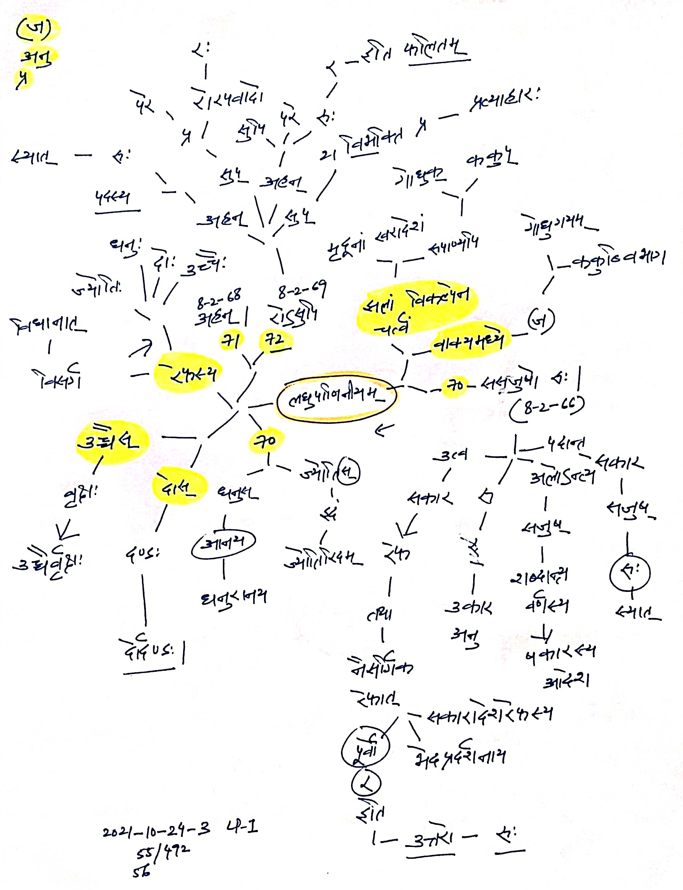
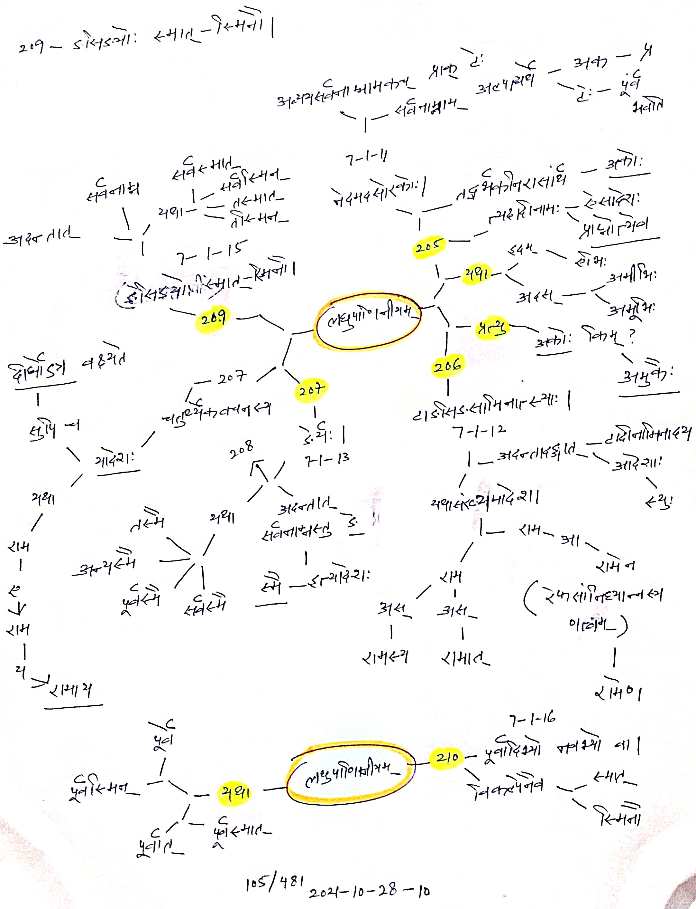
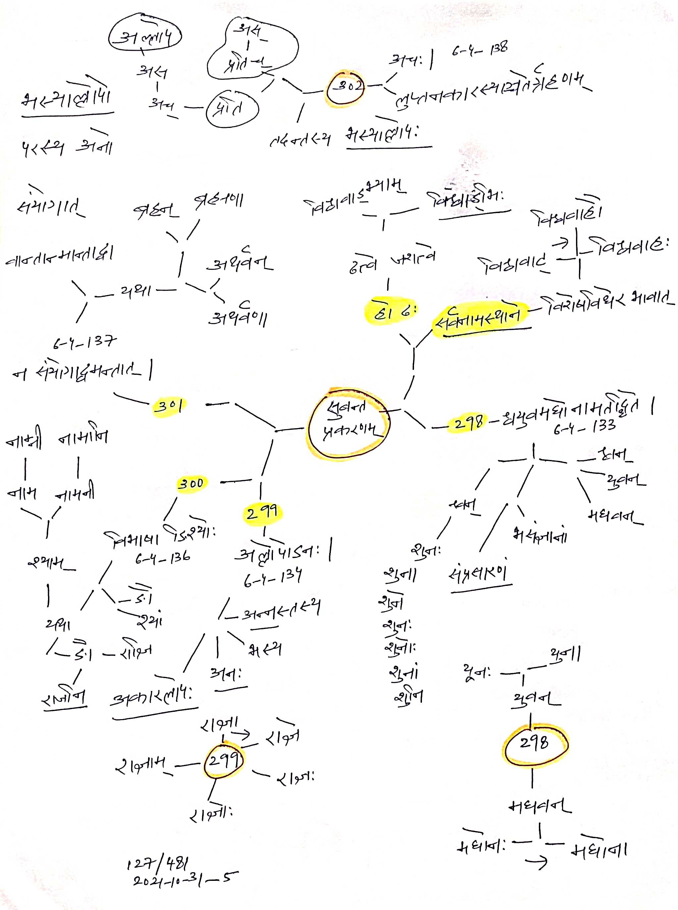

# लघुपाणिनीयम्

## विषयानुक्रमणिका

## २०२१-१०-२२

## २०२१-१०-२३

### संधि प्रकरणम्

## २०२१-१०-२४

## २०२१-१०-२५ 

### शब्दविभागः

## २०२१-१०-२६

## २०२१-१०-२७

## २०२१-१०-२८

## २०२१-१०-२९

## २०२१-१०-३१

## २०२१-११-०२

### [षत्व प्रकरणम्](shatv.md) 

## [णत्व प्रकरणम्](णत्व.md)

## [नामरूपावलिः](naamrupavali.md)

## [तिङन्त](तिङन्त.md)

### [भूवादिगणः](भूवादिगण.md)

### [तुदादिगणः](तुदादिगण.md)

### [दिवादिगणः](दिवादिगण.md)

### [स्वादिगणः](स्वादिगण.md)

### [तनोत्यादिगणः](तनोत्यादिगण.md)

### [क्र्यादिगणः](क्र्यादिगण.md)

### [रुधादिगणः](रुधादिगण.md)

### [अदादिगणः](अदादिगण.md)

### [जुहोत्यादिगणः](जुहोत्यादिगण.md)

## [ऌट-लृङौ-स्यसंस्करण](ऌट-लृङौ-स्यसंस्करण.md)

## [इड्व्यवस्था](इड्व्यवस्था.md)

## [लुट्-तासि-संस्करणकः](लुट्-तासि-संस्करणकः.md)

## [लुङ्-सिजादि-संस्करणकः](लुङ्-सिजादि-संस्करणकः.md)

## [कित्त्व-प्रकरणम्](कित्त्व-प्रकरणम्.md)

## [सिचि-वृद्धिः](सिचि-वृद्धिः.md)

## [सिचो-लुक्](सिचो-लुक्.md)

## [क्सः-संस्करणम्](क्सः-संस्करणम्.md)

## [अङ्-संस्करणम्](अङ्-संस्करणम्.md)

## [चङ्-संस्करणम्](चङ्-संस्करणम्.md)

## [लिट्](लिट्.md)

## [आर्शीलिङ्](आर्शीलिङ्.md)

## [खिलधातवः](खिलधातवः.md)

## [व्युत्पन्ना-धातवः](व्युत्पन्ना-धातवः.md)

## [सार्थको-णिच्](सार्थको-णिच्.md)

## [सार्थकः-सन्](सार्थकः-सन्.md)

## [यङ्यङ्-लुकौ](यङ्यङ्-लुकौ.md)

## [स्वार्थिकप्रत्ययाः](स्वार्थिकप्रत्ययाः.md)

## [नामधातुप्रत्ययाः](नामधातुप्रत्ययाः.md)

## [मिश्रप्रकरणम्](मिश्रप्रकरणम्.md)

## [भावकर्मप्रक्रिया](भावकर्मप्रक्रिया.md)
